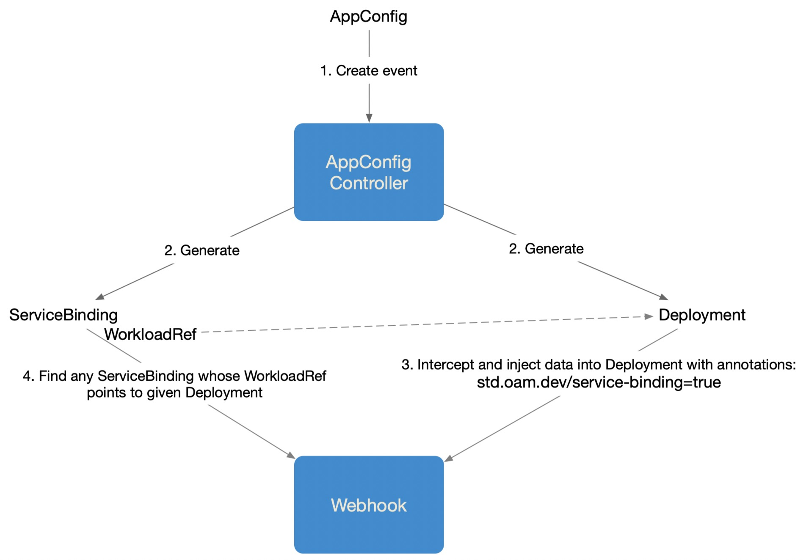

# Trait Injector

Trait injector is a k8s admission webhook to inject data into workload.

How it works with AppConfig controller:



## Build

```bash
make generate
make manifests
make
```

## Test

```bash
make test
```

## SSL

the `ssl/` dir contains a script to create a self-signed certificate, not sure this will even work when running in k8s but that's part of figuring this out I guess

_NOTE: the app expects the cert/key to be in `ssl/` dir relative to where the app is running/started and currently is hardcoded to `mutateme.{key,pem}`_

```bash
pushd ssl/
make
popd
```

## Docker

```bash
make docker-build
```

## Quickstart

Gererate SSL certs if haven't done yet:

```bash
pushd ssl/
make
popd
```

Replace `caBundle` field value in `example/manager.yaml` with the data from below:

```bash
kubectl config view --raw --minify --flatten -o jsonpath='{.clusters[].cluster.certificate-authority-data}'
```

Deploy to Minikube:

```bash
make minikube
```

Create ServiceBinding:

```bash
kubectl create -f ./example/servicebinding.yaml
```

Create the Deployment whose env to inject secret to, and also the Secret:
```bash
kubectl create -f ./example/noenv.yaml
```

Verify the `envFrom` field of the Deployment updated:

```bash
kubectl get deploy busybox1 -o json | jq -r '.spec.template.spec.containers[0]'
```


